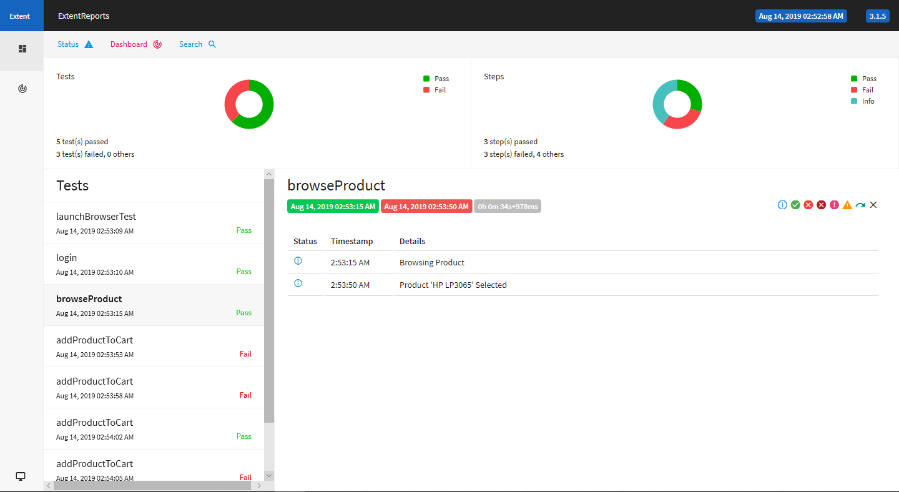

# OpenCart-Automation
The project is based on Java-Selenium technology to automate https://demo.opencart.com/ website.
Functionality covered in this automation Project :
1. Registration of new user
2. login existing user
3. browsing differnt menues
4. Searching Products
5. Entering address details
6. adding products into cart (cart validation)
7. Checkout

## Final Automation Report using Extend Report  

 
